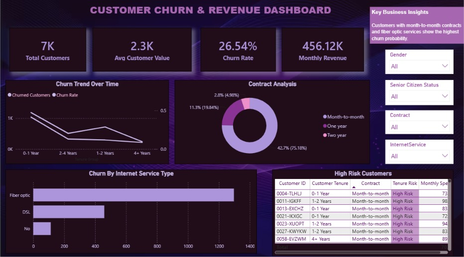
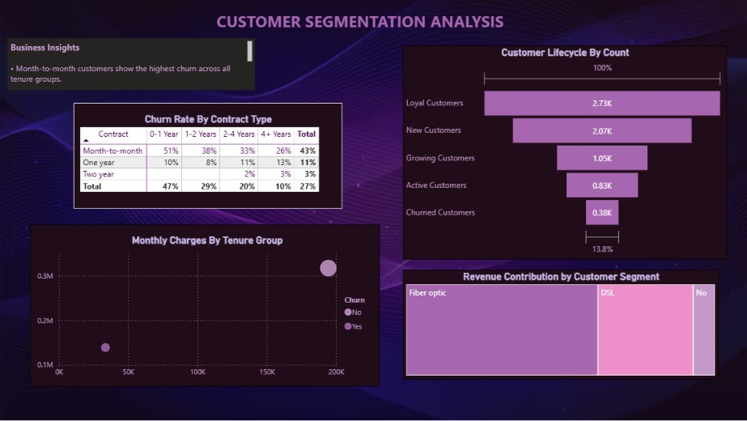
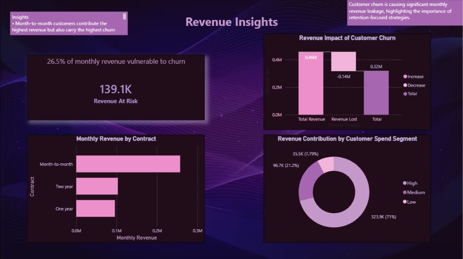
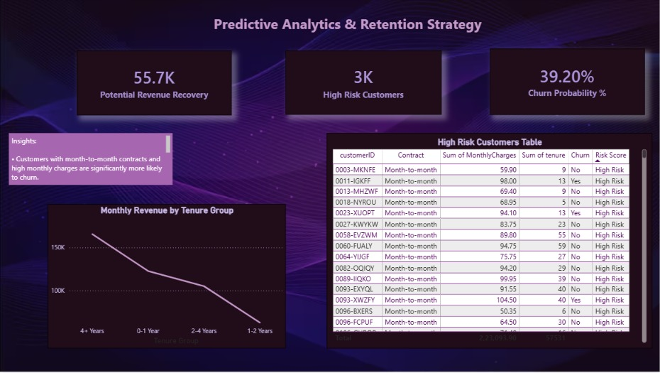

# 📊 Customer Churn Analysis Dashboard | Power BI

## 📌 Project Overview

This project analyzes customer churn using the Telco Customer Churn dataset. The objective is to identify the major factors influencing customer attrition and provide actionable business insights through an interactive Power BI dashboard.

The dashboard enables stakeholders to monitor customer demographics, subscription patterns, contract types, payment methods, and service usage to better understand churn behavior and improve customer retention strategies.

---

## 🎯 Business Problem

Customer churn directly impacts company revenue and profitability. Understanding why customers leave helps businesses improve customer satisfaction and reduce churn.

This dashboard answers questions such as:

- Which customers are most likely to churn?
- Which contract types have the highest churn?
- Does tenure affect churn?
- Which payment methods are associated with higher churn?
- Which services improve customer retention?

---

## 🛠 Tools & Technologies

- Power BI
- Power Query
- DAX
- Microsoft Excel / CSV

---

## 📂 Dataset Information

**Dataset:** Telco Customer Churn

**Records:** 7,043 Customers

**Features:** 21 Columns

Some important columns include:

- Gender
- Senior Citizen
- Partner
- Dependents
- Tenure
- Internet Service
- Phone Service
- Contract
- Payment Method
- Monthly Charges
- Total Charges
- Churn

---

## 📈 Dashboard KPIs

- Total Customers
- Churned Customers
- Active Customers
- Churn Rate (%)
- Average Monthly Charges
- Average Customer Tenure

---

## 📊 Dashboard Analysis

### Customer Demographics

- Gender Distribution
- Senior Citizens
- Partner vs Non-Partner
- Dependents Analysis

### Subscription Analysis

- Phone Service
- Internet Service
- Online Security
- Online Backup
- Device Protection
- Tech Support
- Streaming TV
- Streaming Movies

### Contract Analysis

- Month-to-Month
- One-Year Contract
- Two-Year Contract

### Payment Analysis

- Electronic Check
- Credit Card
- Bank Transfer
- Mailed Check

### Revenue Analysis

- Monthly Charges
- Total Charges
- Average Revenue

---

## 🔍 Key Insights

- Customers with **Month-to-Month contracts** have the highest churn rate.
- Customers paying through **Electronic Check** are more likely to churn.
- Longer customer tenure is associated with lower churn.
- Customers using **Online Security** and **Tech Support** services have better retention.
- Fiber Optic internet users contribute significantly to overall churn.

---

## 📌 Project Workflow

1. Data Collection
2. Data Cleaning using Power Query
3. Data Transformation
4. Data Modeling
5. DAX Measure Creation
6. Dashboard Development
7. Business Insights

---

## 📷 Dashboard Preview

### Dashboard Overview



### Customer Demographics



### Contract Analysis



### Key Insights



---

## 🚀 Skills Demonstrated

- Data Cleaning
- Data Transformation
- Data Modeling
- DAX Calculations
- KPI Development
- Interactive Dashboard Design
- Business Intelligence
- Data Storytelling

---

## 📁 Repository Structure

```
Customer-Churn-Analysis-PowerBI
│
├── README.md
├── Customer_Churn_Analysis.pbix
├── Telco-Customer-Churn.csv
├── images
└── LICENSE
```

---

## 👩‍💻 Author

**Ishika Mangla**

🔗 LinkedIn: https://www.linkedin.com/in/ishika-mangla-b96541419

💻 GitHub: https://github.com/ishika2193
